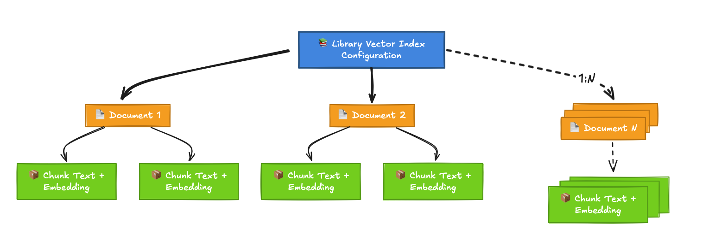

# My Vector Database

A lightweight, production-ready vector database with a RESTful API and Python SDK. Built with FastAPI and Pydantic, it supports storing documents with vector embeddings and provides efficient similarity search using custom-implemented vector indexes.

## Prerequisites

- [uv](https://docs.astral.sh/uv/getting-started/installation/)
- Docker or Podman

> **Note:** This project uses `uv` for all Python operations including dependency management, testing, and running the server.

## Core Concepts

My Vector Database organizes data in a three-tier hierarchy:

```
Libraries → Documents → Chunks
```

- **Libraries**: Top-level containers with their own vector index configuration (FLAT, HNSW)
- **Documents**: Logical groupings of related text chunks within a library
- **Chunks**: Individual pieces of text with vector embeddings and metadata (the searchable units)

This structure allows you to organize and search your data at different levels of granularity. For example, a library might contain multiple PDF documents, each document split into searchable chunks with embeddings.

## Quick Start

### Installation

```bash
# Clone the repository
git clone https://github.com/ajshedivy/my-vector-db.git
cd my-vector-db

# Install dependencies with uv
uv sync
```

### Start the Server

```bash
# Using Docker
docker compose up -d

# Using Podman
podman compose up -d
```

The API will be available at:
- **API**: http://localhost:8000
- **Interactive Documentation**: http://localhost:8000/docs
- **Health Check**: http://localhost:8000/health

### Using the Python SDK

Here's a complete workflow in ~15 lines:

```python
from my_vector_db.sdk import VectorDBClient

client = VectorDBClient(base_url="http://localhost:8000")

# Create library → document → chunks
library = client.create_library(name="docs", index_type="flat")
document = client.create_document(library_id=library.id, name="intro")

# Add chunks with embeddings
chunks = client.add_chunks(
    document_id=document.id,
    chunks=[
        {
            "text": "AI enables pattern recognition",
            "embedding": [0.9, 0.8, 0.1, 0.2, 0.3],
        },
        {
            "text": "Deep learning uses neural networks",
            "embedding": [0.85, 0.75, 0.15, 0.25, 0.35],
        },
    ],
)

# Search for similar content
results = client.search(
    library_id=library.id, embedding=[0.88, 0.78, 0.12, 0.22, 0.32], k=5
)
for result in results.results:
    print(f"{result.score:.4f} - {result.text}")
```

**For comprehensive SDK documentation**, see the [SDK Reference Guide](docs/README.md) which covers:
- Detailed API reference for all operations
- Advanced filtering (metadata, time-based, custom functions)
- Persistence management (snapshots, backups, restore)
- Vector index configuration and best practices
- Performance optimization and error handling

## Architecture

### Data Model

The vector database has three main data components organized in a hierarchical structure:



**Key Relationships:**
- One Library contains **many** Documents (1:N)
- One Document contains **many** Chunks (1:N)
- Search operations are performed at the **Library** level across all chunks
- Vector indexes are built and configured per **Library**

**For detailed API and service layer architecture**, see the [API Architecture Diagram](docs/api-architecture.png).

#### Libraries
A library is a top-level container for documents with its own vector index configuration.

**Attributes:**
- `id`: Unique identifier (UUID)
- `name`: Library name
- `index_type`: Type of vector index (`flat`, `hnsw`)
- `index_config`: Index-specific configuration (e.g., distance metric)
- `metadata`: Optional metadata dictionary
- `document_ids`: List of document IDs in the library
- `created_at`, `updated_at`: Timestamps

#### Documents
A document represents a logical grouping of text chunks within a library.

**Attributes:**
- `id`: Unique identifier (UUID)
- `library_id`: Parent library ID
- `name`: Document name
- `metadata`: Optional metadata dictionary
- `chunk_ids`: List of chunk IDs in the document
- `created_at`, `updated_at`: Timestamps

#### Chunks
A chunk is a single piece of text with its vector embedding and metadata (the searchable unit).

**Attributes:**
- `id`: Unique identifier (UUID)
- `document_id`: Parent document ID
- `text`: Text content
- `embedding`: Vector embedding (list of floats)
- `metadata`: Optional metadata dictionary
- `created_at`, `updated_at`: Timestamps

### Project Structure

The project follows **Domain-Driven Design** principles with clear separation of concerns:

- **Domain Layer** (`src/my_vector_db/domain/`): Core business models using Pydantic
- **Service Layer** (`src/my_vector_db/services/`): Business logic and orchestration
- **API Layer** (`src/my_vector_db/api/`): FastAPI endpoints and request/response DTOs
- **Infrastructure Layer** (`src/my_vector_db/infrastructure/`): Storage and vector index implementations

### Vector Indexes

#### FLAT Index (Exact Search) ✅ Implemented

Exhaustive brute-force search comparing the query vector against every stored vector.

**Characteristics:**
- **Time Complexity**: O(n·d) search, O(1) insert
- **Space Complexity**: O(n·d)
- **Recall**: 100% (exact results, guaranteed true nearest neighbors)
- **Best For**: Small to medium datasets (< 10,000 vectors), when accuracy is critical

**Supported Metrics**: `cosine`, `euclidean`, `dot_product`

```python
library = client.create_library(
    name="my_library",
    index_type="flat",
    index_config={"metric": "cosine"}
)
```

#### HNSW Index (Approximate Search) ⚠️ Planned

Hierarchical Navigable Small World graph-based approximate nearest neighbor algorithm.

**Planned Characteristics:**
- **Time Complexity**: O(log n) search (approximate)
- **Space Complexity**: O(n·M·log n)
- **Recall**: 95-99% (configurable)
- **Best For**: Large datasets (> 10,000 vectors), when speed is more important than perfect accuracy

**Note**: The HNSW index is defined in the API but not yet fully implemented.

For detailed index configuration and performance considerations, see the [Vector Indexes Documentation](docs/README.md#vector-indexes).

## API Reference

### Libraries
| Method | Endpoint | Description |
|--------|----------|-------------|
| POST | `/libraries` | Create a new library |
| GET | `/libraries` | List all libraries |
| GET | `/libraries/{library_id}` | Get library by ID |
| PUT | `/libraries/{library_id}` | Update library |
| DELETE | `/libraries/{library_id}` | Delete library |
| POST | `/libraries/{library_id}/build-index` | Build or rebuild vector index |

### Documents
| Method | Endpoint | Description |
|--------|----------|-------------|
| POST | `/libraries/{library_id}/documents` | Create document in library |
| POST | `/libraries/{library_id}/documents/batch` | Batch create documents in library |
| GET | `/libraries/{library_id}/documents` | List documents in library |
| GET | `/documents/{document_id}` | Get document by ID |
| PUT | `/documents/{document_id}` | Update document |
| DELETE | `/documents/{document_id}` | Delete document |

### Chunks
| Method | Endpoint | Description |
|--------|----------|-------------|
| POST | `/documents/{document_id}/chunks` | Create chunk in document |
| POST | `/documents/{document_id}/chunks/batch` | Batch create chunks in document |
| GET | `/documents/{document_id}/chunks` | List chunks in document |
| GET | `/chunks/{chunk_id}` | Get chunk by ID |
| PUT | `/chunks/{chunk_id}` | Update chunk |
| DELETE | `/chunks/{chunk_id}` | Delete chunk |

### Search
| Method | Endpoint | Description |
|--------|----------|-------------|
| POST | `/libraries/{library_id}/query` | Perform k-nearest neighbor search |

### Persistence
| Method | Endpoint | Description |
|--------|----------|-------------|
| POST | `/persistence/save` | Save database snapshot to disk |
| POST | `/persistence/restore` | Restore from latest snapshot |
| GET | `/persistence/status` | Get persistence status and statistics |

**API Design Note**: The API uses a simplified flat structure for direct resource access. Once created, documents and chunks can be accessed by their globally unique UUIDs without specifying parent resources, reducing API verbosity.

For interactive API exploration, visit http://localhost:8000/docs after starting the server.

## Features

### Core Features ✅

- [x] **CRUD Operations**: Full create, read, update, delete for libraries, documents, and chunks
- [x] **Vector Indexes**: FLAT index implementation with cosine, euclidean, and dot product metrics
- [x] **K-Nearest Neighbor Search**: Efficient similarity search with configurable result count
- [x] **Metadata Support**: Flexible metadata dictionaries for all entities
- [x] **Thread-Safe Operations**: Proper concurrency control for read/write operations

### Advanced Features ✅

- [x] **Metadata Filtering**: Server-side declarative filters with complex logic (AND/OR, nested filters)
- [x] **Custom Filter Functions**: Client-side Python filter functions for advanced use cases
- [x] **Data Persistence**: Save/restore database snapshots with automatic and manual triggers
- [x] **Python SDK Client**: Fully-featured, type-safe SDK with comprehensive documentation
- [x] **Batch Operations**: Efficient bulk insert for chunks with atomic transactions
- [x] **Comprehensive Testing**: Unit tests with >80% coverage

### Extra Features

See the [task requirements](task.md) for the complete feature checklist and implementation details.

## Integrations

### Agno Framework

The vector database integrates seamlessly with the [Agno](https://github.com/agno-ai/agno) agent framework for building RAG (Retrieval-Augmented Generation) applications.

```python
from agno.agent import Agent
from agno.knowledge.knowledge import Knowledge
from agno.models.anthropic import Claude
from my_vector_db.db import MyVectorDB

# Create vector database
vector_db = MyVectorDB(
    api_base_url="http://localhost:8000",
    library_name="knowledge_base",
    index_type="flat"
)

# Create knowledge base
knowledge = Knowledge(
    name="My Knowledge Base",
    vector_db=vector_db,
    max_results=5
)

# Add content
knowledge.add_content(
    name="example",
    text_content="Your content here"
)

# Create agent with knowledge
agent = Agent(
    name="Assistant",
    knowledge=knowledge,
    model=Claude(id="claude-sonnet-4-5"),
    search_knowledge=True
)

agent.cli_app(stream=True)
```

For a complete working example, see [`examples/agno_example.py`](examples/agno_example.py).

## Testing

```bash
# Run all tests
uv run pytest

# Run with coverage report
uv run pytest --cov=my_vector_db --cov-report=html

# Run specific test file
uv run pytest tests/test_sdk.py -v

# Run with verbose output
uv run pytest -vv
```

## Configuration

### Environment Variables

```bash
# API server settings
VECTOR_DB_HOST=0.0.0.0
VECTOR_DB_PORT=8000

# SDK client settings
VECTOR_DB_BASE_URL=http://localhost:8000
VECTOR_DB_TIMEOUT=30

# Persistence settings (optional)
ENABLE_STORAGE_PERSISTENCE=false
STORAGE_DIR=./data
STORAGE_SAVE_EVERY=-1  # -1 disables automatic saves
```

For detailed persistence configuration and workflows, see the [Persistence Management Documentation](docs/README.md#persistence-management).

### Docker Configuration

```yaml
# Production deployment
docker compose up -d

# Development with hot reload
docker compose --profile dev up vector-db-dev
```

## Examples

The `examples/` directory contains complete usage examples:

- **`sdk_example.py`**: Basic SDK usage with CRUD operations and custom filters
- **`batch_example.py`**: Efficient batch operations for adding multiple chunks
- **`agno_example.py`**: Integration with Agno framework for agent applications

## Development

### Code Quality Tools

```bash
# Format code
uv run ruff format

# Lint code
uv run ruff check

# Type checking
uv run mypy src/my_vector_db
```

### Design Principles

This project follows **SOLID principles** and implements:
- Static typing throughout (Pydantic models, type hints)
- Domain-Driven Design (separation of domain, service, API, and infrastructure layers)
- Early returns and guard clauses for readability
- Composition over inheritance
- RESTful API design with proper HTTP status codes
- Comprehensive error handling with custom exceptions

## Documentation

- **[SDK Reference Guide](docs/README.md)**: Complete SDK documentation with examples
- **[API Documentation](http://localhost:8000/docs)**: Interactive OpenAPI/Swagger documentation (available when server is running)
- **[API Architecture Diagram](docs/api-architecture.png)**: Detailed service and API layer architecture

## Author

**Adam Shedivy**
📧 ajshedivyaj@gmail.com
🔗 [GitHub](https://github.com/ajshedivy)

## License

MIT License - see LICENSE file for details
