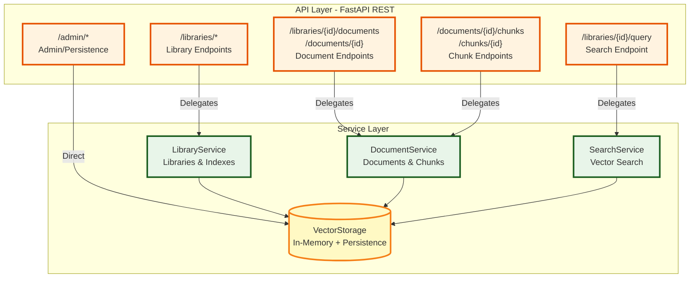
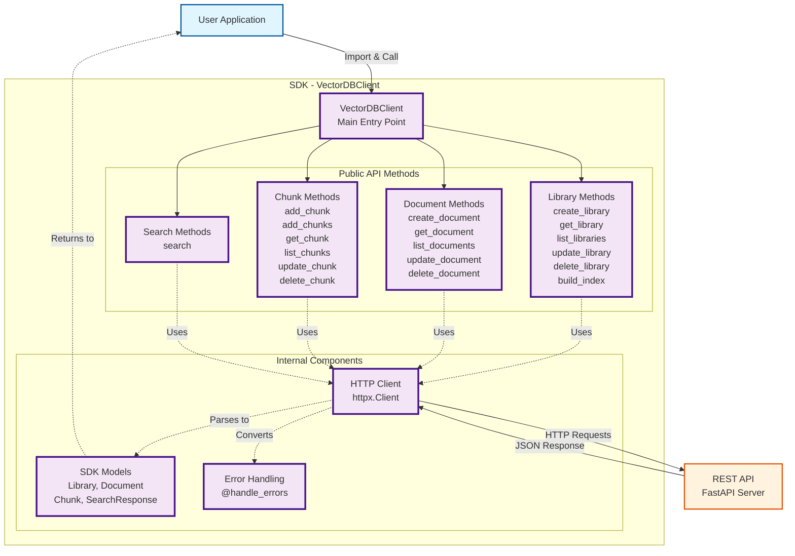

# My Vector DB - Architecture Overview

## API & Service Layer Architecture

**API Layer**: FastAPI REST endpoints that validate requests and delegate to services
**Service Layer**: Business logic for libraries, documents, chunks, and vector search
**Storage**: Thread-safe in-memory storage with optional JSON persistence

---

## SDK Architecture

**VectorDBClient**: Main SDK class with flat API for all operations
**Public Methods**: Intuitive methods for libraries, documents, chunks, and search
**Internal Components**: HTTP client, type-safe models, automatic error handling

## Architecture Layers

### 1. Client Layer
- **User Applications**: Direct users of the vector database
- **Agno AI Agents**: AI agents using the Agno framework integration

### 2. SDK Layer (Python Client)
- **VectorDBClient**: Main entry point for SDK users, provides a flat API
- **SDK Models**: Type-safe Pydantic models for requests and responses
- **Error Handling**: Automatic HTTP error conversion to SDK exceptions

### 3. API Layer (FastAPI REST)
- **Main Application**: FastAPI app with lifecycle management and CORS
- **Routes**: REST endpoints for all operations
- **Schemas**: Request/Response validation models
- **Endpoint Groups**:
  - Libraries: Create, read, update, delete, build index
  - Documents: CRUD operations, batch creation
  - Chunks: CRUD operations, batch creation
  - Search: Vector similarity search with filters
  - Admin: Persistence management (snapshot save/restore)

### 4. Service Layer (Business Logic)
- **LibraryService**: Manages libraries and vector indexes
- **DocumentService**: Handles documents and chunks
- **SearchService**: Performs kNN search with metadata filtering

### 5. Domain Layer (Core Models)
- **Domain Models**: Pydantic entities (Library, Document, Chunk)
- **Filter Models**: Declarative metadata filtering system
- **Filter Evaluator**: Evaluates filter expressions on chunks

### 6. Index Layer (Vector Search)
- **Base Index**: Abstract interface for vector indexes
- **Flat Index**: Exact brute-force search (O(n))
- **HNSW Index**: Graph-based approximate nearest neighbor search

### 7. Storage Layer (Data Persistence)
- **VectorStorage**: Thread-safe in-memory storage with RLock
- **Serialization**: JSON-based snapshot persistence

### 8. Integration Layer
- **MyVectorDB**: Agno framework adapter implementing VectorDb interface

## Key Design Patterns

### Layered Architecture
- Clear separation of concerns across layers
- Each layer depends only on layers below it
- Domain models are shared across all layers

### Service Layer Pattern
- Business logic isolated from API controllers
- Services coordinate between storage, indexes, and domain logic
- Makes testing and reuse easier

### Repository Pattern (VectorStorage)
- Thread-safe data access with RLock
- In-memory storage with optional disk persistence
- Atomic operations for consistency

### Adapter Pattern (MyVectorDB)
- Adapts SDK to Agno framework interface
- Enables use with Agno AI agents
- Wraps VectorDBClient for framework compatibility

### Factory Pattern (Index Creation)
- LibraryService creates appropriate index type (Flat/HNSW)
- Index selection based on Library configuration
- Polymorphic index interface

## Data Flow

### Write Operations
1. Client → SDK → REST API → Routes
2. Routes → Service Layer (validation & business logic)
3. Service → Storage (thread-safe CRUD)
4. Storage → Indexes (update vector index)
5. Optional: Storage → Disk (snapshot persistence)

### Search Operations
1. Client → SDK → REST API → Search Endpoint
2. SearchService → Index (kNN search)
3. SearchService → Storage (retrieve full chunk data)
4. SearchService → FilterEvaluator (apply metadata filters)
5. Results → Client (with similarity scores)

### Index Management
1. LibraryService creates index on library creation
2. Index auto-builds when first accessed
3. Manual build via `/libraries/{id}/index/build` endpoint
4. HNSW benefits from explicit rebuild after bulk inserts

## Thread Safety
- VectorStorage uses RLock for all operations
- Reentrant lock allows nested operations
- Prevents data races in concurrent environments
- Safe for use with Uvicorn workers

## Persistence
- Optional snapshot-based persistence
- Configurable via environment variables
- Atomic writes to prevent corruption
- Manual and automatic save triggers
